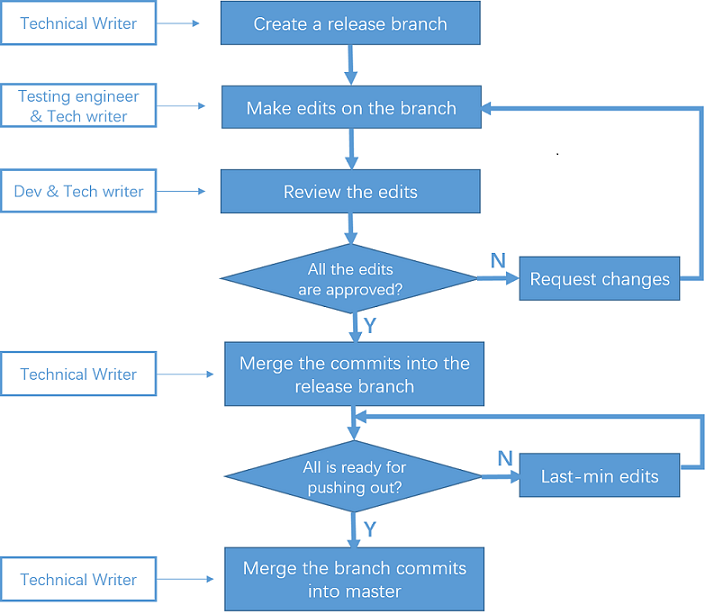
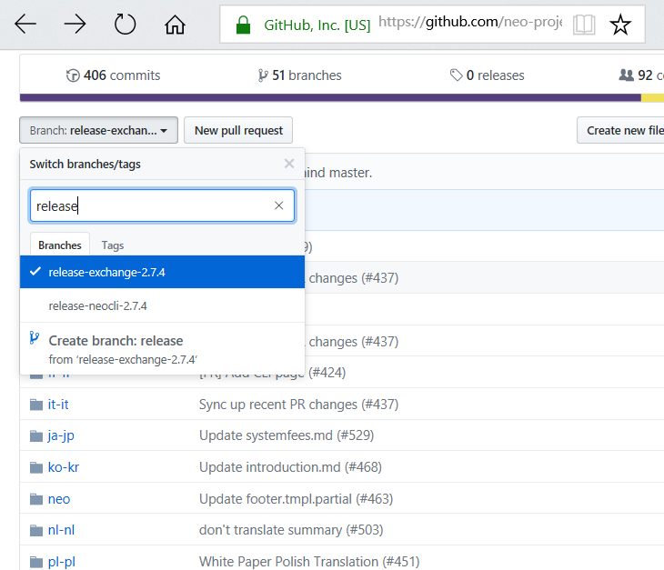

# Git branches and workflow for NEO Doc

This document presents Git branches and workflow we have been using for NEO documentation development. You can also learn how to contribute to NEO documentation in this document.

## Branches and naming conventions

| Branch      | Naming Convention              | Description                                                  |
| ----------- | ------------------------------ | ------------------------------------------------------------ |
| master      | master                         | The main branch where the the official NEO documents on  [NEO documentation website](http://docs.neo.org/) are built from. |
| release     | release-version number-*       | The branches for any updates of a new release                |
| enhancement | enhance-folder or topic name-* | The branches for improving existing document quality         |
| bug         | bug-*                          | The branches for fixing document bugs                        |

### master

master is the main branch where the content is always ready for publishing on website. All the commits on other branches will be merged into this branch eventually.

### Release branches

Release branches support every updates of a new production release. It is a branch in preparation for an upcoming release or a distant future release. For example, say version 2.7.4 is going to be released in a near future, we will then create a 2.7.4 branch on which the team can cooperatively and centrally develop and edit 2.7.4-specific information. After all the commits have been merged into 2.7.4 branch and last-minutes checks have been done, the branch will be merged into master once the release are approved to pushed out on website.

Currently for NEO documentation, the following topics have release branches:

- NEO-CLI API documents
- Document for exchange developers

A release branch will not be deleted for the purpose of keeping historic records. 

### Enhancement branches

Enhancement branches are created for improving existing documents in terms of content, structure, phrasing, formatting, and so on. 

An enhancement branch is deleted after all its commits are merged into the master branch. 

In some cases when files changed on an enhancement branch overlap with those changed on a release branch, you may need to merge the enhancement branch changes into the release branch as well to avoid conflicts when merging the release branch into master.

### Bug branches

When language mistakes, broken links, typos, formatting issues, and suchlike bugs are found, bug branches should be created from master for resolving those issues.

A bug branch is deleted after its commits are merged into the master branch.

In some cases when files changed on a bug branch overlap with those changed on a release branch, you may need to merge the bug branch changes into the release branch as well to avoid conflicts when merging the release branch into master.

## Document development workflow

Taking a release branch as an example, the typical workflow is presented in the figure below:

For major changes or brand new doc, technical writer reviews the outline and the doc first before editing on the branch. 

## How to edit NEO documents on GitHub?

You can edit NEO documentation directly on GitHub and merge the changes by submitting pull requests.

To update an existing document on master:

1. Choose one of the following:

   1. Go to [NEO documentation website](http://docs.neo.org/) and navigate to the page you want to edit. Click **Improve this Doc** in the upper right of the page.
   2. Go to [GitHub NEO docs project](https://github.com/neo-project/docs) and navigate to the desired file. Click the pencil icon to edit the file. 

2. After you complete the changes, click **Propose file change** at the bottom. Note that a new branch is created for this commit. 

3. In the *Comparing changes* page, click **Create pull request**.

   Your pull request will be reviewed and approved shortly if no issue. You can also check your request status at [Pull Requests](https://github.com/neo-project/docs/pulls).

To add a new file:

1. Go to [GitHub NEO docs project](https://github.com/neo-project/docs) and navigate to the desired path.
2. Click **Create new file** or **Upload** an .md file prepared beforehand. 
3. Commit changes and create pull request. 

To make changes on a branch other than master, you need to firstly switch to that branch doc set by selecting the branch name in the Branch list. Then you can follow the same steps as described above for updating the master documents.

